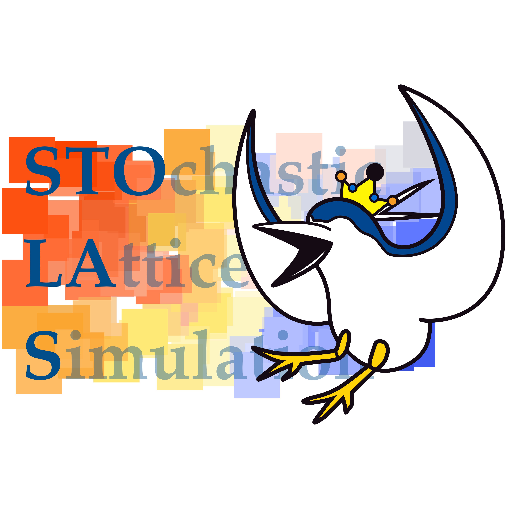
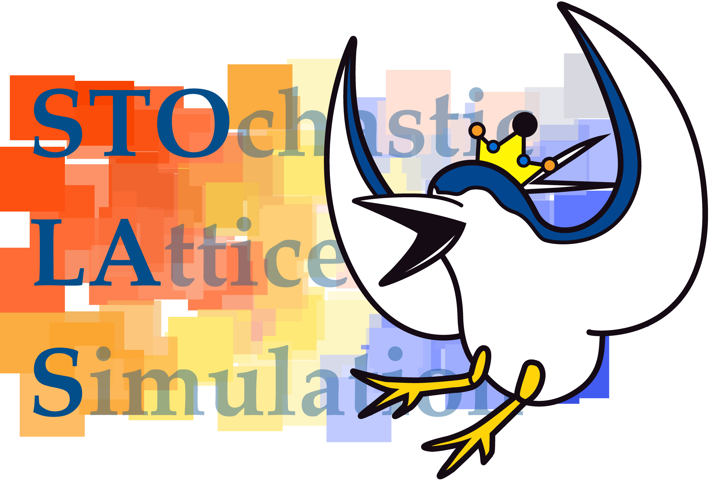

  <!--  -->
  

# How to use STOLAS

## Download
Download from the GitHub page [STOLAS](https://github.com/STOchasticLAtticeSimulation/STOLAS_dist) to the local folder.

## Set the parameters
You may change parameteres of STOLAS by changing *parameters.hpp*.
- **sigma**: ksigma = 2pi sigma exp(N) / L, nsigma = sigma exp(N)
- **dn**: Thickness of nsigma sphere shell
- **NL**: Box size L
- **dN**: e-folds step
- **Nprec**: Precision of e-foldings
- **dlogn**: Width of bin in power spectrum

You can choose output of the result.
- **szeta**: Output the curvature perturbation
- **spower**: Output the power spectrum
- **scompaction**: Output the compaction function
- **sanimation**: Output the animation

## Make map of noise and bias
- Go to source directry
`cd source`

- Make directlies 'noisedata' nad 'biasdata' in source directly
`mkdir noisedata biasdata`

- Compile 
`make`

- Make a biasmap
`./biasmap`

- Make a nisemap with file number (now we choose number '0')
`./noisemap 0`

## The first Run: chaotic inflation
- Go to model directry
`cd ../chaotic`

- Compile
`make`

- Make a map of curvature perturbation with noisemap filenumber
`./chaotic 0`

## Impotance sampling
In *parameters.hpp*, you can change the detail of the bias.
- **Nbias**: Time of the bias
- **dNbias**: Variance of the bias
- **bias**: Amplitude of the bias

